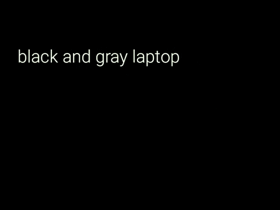

# explore

Explore is an app that recurrently takes pictures on background of the user viewport and then creates GIFs with the provided images and discover which elements or objects the user is seeing.

# demo

The following GIFs shows a demo of the application running on Google Glass. The GIFs are from the same video but splitted.

The demostration used the following images:

[Picture 1](demo/Picture_20150018070002.jpg)
[Picture 2](demo/Picture_20150018070013.jpg)
[Picture 3](demo/Picture_20150018070023.jpg)
[Picture 4](demo/Picture_20150018070034.jpg)
[Picture 5](demo/Picture_20150018070044.jpg)
[Picture 6](demo/Picture_20150018070054.jpg)
[Picture 7](demo/Picture_20150118070104.jpg)
[Picture 8](demo/Picture_20150118070115.jpg)
[Picture 9](demo/Picture_20155918065931.jpg)
[Picture 10](demo/Picture_20155918065942.jpg)
[Picture 11](demo/Picture_20155918065952.jpg)
